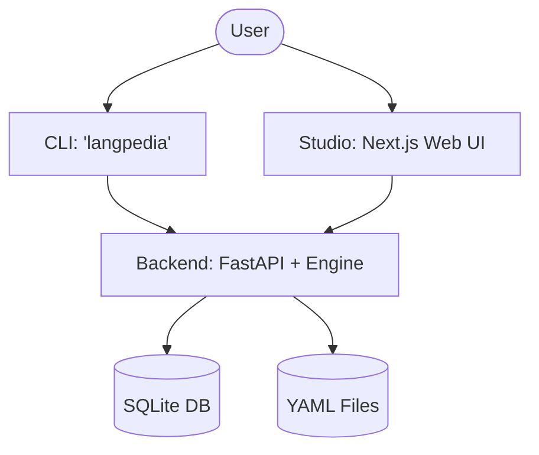

# Langpedia v0.1

All-in-one AI orchestration tool: agents + RAG + MCP tool access.

## Structure
- `/backend`: FastAPI backend.
- `/cli`: Python CLI tool.
- `/studio`: Next.js web application.
- `/shared`: Shared models and schemas.

## Getting Started

### CLI
```bash
pip install -e .
langpedia init
langpedia run workflows/starter.yaml
```

## 📖 Documentation
Detailed guides for scaling your AI projects:
- [Workflow Guide](docs/workflows_guide.md): Learn YAML syntax, data wiring, and project organization.

### Backend
```bash
pip install -r backend/requirements.txt
uvicorn backend.app.api.main:app --reload
```

### Studio
```bash
cd studio
npm install
npm run dev
```


# Langpedia v0.1: Technical Architecture & Explanation

Langpedia is a modular AI orchestration platform. This document explains how the different parts of the code interact to build, visualize, and run AI workflows.

---

## 🏗️ Project Architecture

Langpedia is organized as a **Monorepo** with four main components:



### 1. `/shared` (The Language)
Contains `workflow.py` which defines the **Workflow Specification**. Every workflow follows a structure defined here using Pydantic. This ensures that the CLI, Backend, and Studio all "speak the same language."

### 2. `/backend` (The Brain)
*   **`api/main.py`**: The entry point. Handles communication with the UI and CLI. It implements "Hybrid Storage"—it reads workflows from the database *and* scans the `/workflows` folder automatically.
*   **`engine/runner.py`**: The **Execution Engine**. It takes a YAML/JSON spec and runs it. It handles "Topological Sorting" (deciding which node runs first) and manages data flow between nodes.
*   **`models/database.py`**: Defines how Workflows, Runs, and Traces are stored in the `langpedia.db` SQLite file.

### 3. `/cli` (The Remote Control)
Built with `typer` and `rich`.
*   **`main.py`**: Contains the command logic. 
    *   `init`: Sets up a project and syncs it with the UI.
    *   `use`: Stores the path of your active workflow in `.langpedia_state`.
    *   `run`: Triggers the `runner.py` (Local) or sends a request to the Backend (Remote).
    *   `list`: Queries the directory to show you what you've built.

### 4. `/studio` (The Eyes)
A Next.js 16+ application using **React Flow**.
*   **`page.tsx`**: The main dashboard. It fetches workflows from the backend and maps them to visual nodes.
*   **`WorkflowCanvas.tsx`**: The visual canvas where nodes and edges are rendered. It uses the `spec.nodes` and `spec.edges` data to draw the logic graph.

---

## 🔄 How Synchronization Works

Langpedia uses a **Bidirectional Sync** philosophy:

1.  **File -> UI**: The Backend (`main.py`) monitors the `/workflows` folder. When you change a YAML file in your editor, the Backend re-reads it and provides the updated structure to the Studio UI when you refresh.
2.  **UI -> DB**: When you use the visual "Save" button in the Studio, the workflow is saved into the SQLite database.
3.  **De-duplication**: The system is smart enough to know that if `rag.yaml` exists on disk and in the DB, the local file is the priority (Source of Truth).

---

## ⚡ Data Flow: Running a Workflow

When you click "Run" or type `langpedia run`:

1.  **Input Injection**: The engine takes your initial input (e.g., a user query).
2.  **Dependency Check**: It looks at every node's `inputs` field (e.g., `["my_kb.docs"]`).
3.  **Execution**:
    *   Node A runs first.
    *   Its result is stored in a `node_outputs` dictionary.
    *   Node B sees its dependency is ready, collects the result from Node A, and runs.
4.  **Tracing**: Every step is logged as an "Event" in the database so you can debug what happened in the Trace Viewer.

---

## 🛠️ Key Technologies
- **Python**: Core logic and CLI.
- **FastAPI**: High-performance API.
- **SQLite + SQLAlchemy**: Lightweight persistence.
- **Next.js + Tailwind**: Modern, responsive UI.
- **React Flow**: Interactive node-based Canvas.
