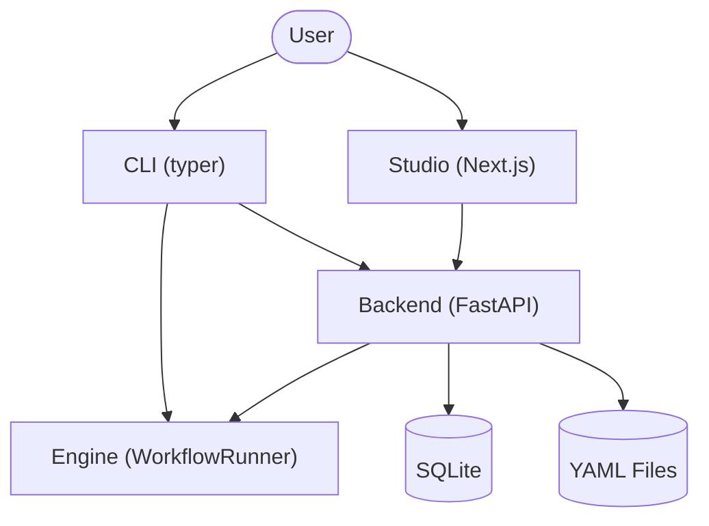
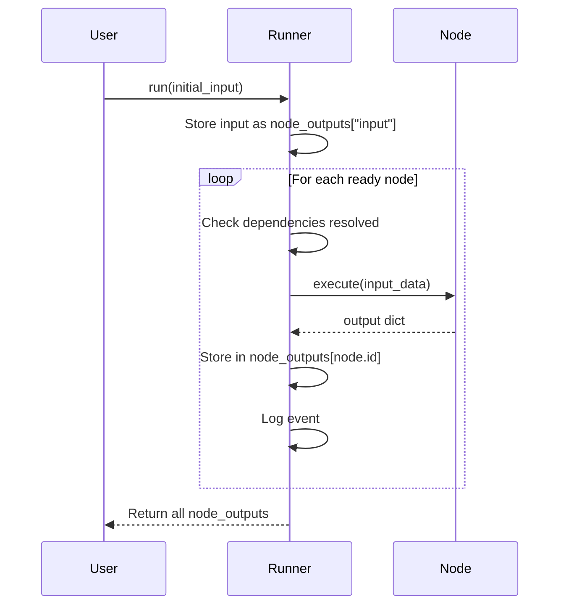

# Architecture

Langpedia is a modular AI orchestration platform organized as a monorepo with four main components.

## High-Level Overview

## Components

### `shared/` — The Schema Layer

Defines the common Pydantic models used everywhere:

| Model | Fields | Purpose |
|---|---|---|
| `NodeSpec` | `id`, `type`, `inputs`, `params`, `scripts` | Defines a single node in a workflow |
| `EdgeSpec` | `source`, `target` | Defines a directed edge between nodes |
| `WorkflowSpec` | `version`, `name`, `nodes`, `edges` | The full workflow specification |

All components (CLI, Backend, Studio) serialize and deserialize using these models.

---

### `backend/` — The Brain

#### API Layer (`backend/app/api/main.py`)

FastAPI application serving REST endpoints. Uses CORS middleware (permissive for MVP). Implements **hybrid storage** — reads workflows from both the filesystem and the database, with local YAML files taking priority.

#### Engine (`backend/app/engine/`)

The execution engine that runs workflows:

- **`runner.py`** — `WorkflowRunner` takes a `WorkflowSpec` and executes nodes in topological order (dependencies first). Includes deadlock detection and event logging.
- **`nodes/base.py`** — Abstract base classes: `BaseNode` (executor), `NodeContext` (event emitter), `NodeScript` (user-defined logic with validate → run → evaluate lifecycle).
- **`nodes/rag_node.py`** — `RAGRetrieveNode`, the first concrete node type. Performs extraction → vectorization → retrieval with support for user-defined scripts.
- **`nodes/registry.py`** — `NODE_REGISTRY` maps type strings to `BaseNode` subclasses.

#### Database (`backend/app/models/database.py`)

SQLite via SQLAlchemy with three tables:

| Table | Key Columns | Purpose |
|---|---|---|
| `workflows` | `id`, `name`, `spec` (JSON), `created_at` | Persists workflow definitions |
| `runs` | `id`, `workflow_id` (FK), `status`, `created_at` | Tracks execution runs |
| `traces` | `id`, `run_id` (FK), `events` (JSON) | Stores event logs per run |

---

### `cli/` — The Remote Control

Built with `typer` and `rich`. Entry point: `langpedia` command. Supports both local execution (using `WorkflowRunner` directly) and remote execution (posting to FastAPI backend).

---

### `studio/` — The Visual Editor

Next.js 16+ application using React Flow (`@xyflow/react`).

- **`page.tsx`** — Dashboard that fetches workflows from the backend, renders a sidebar with workflow list + node library, and provides Save/Run buttons.
- **`WorkflowCanvas.tsx`** — React Flow wrapper component rendering the interactive node-and-edge graph.

---

## Data Flow

## Synchronization

Langpedia uses **bidirectional sync**:

1. **File → UI**: Backend scans `workflows/` folder. Changes to YAML files are reflected in Studio on refresh.
2. **UI → DB**: The Studio "Save" button persists workflows to SQLite.
3. **De-duplication**: If a workflow name exists both on disk and in the DB, the local file wins.
